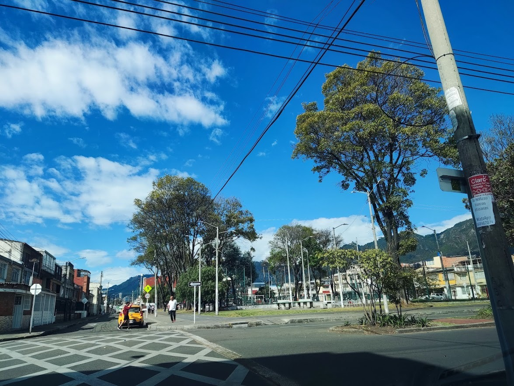

# Problemáticas Parques Ciudad Jardín

## Introducción
En el barrio Ciudad Jardín hay 4 parques importantes que presentan diversas problemáticas. A pesar de que los parques en general están en buen estado, existen problemáticas y puntos a mejorar en cada uno. Este informe tiene como objetivo documentar dichas problemáticas con una breve descripción de cada parque, su ubicación, y evidencia fotográfica.

## Índice
1. Parque principal Los fundadores
2. Parque del río Fucha
3. Parque pequeño de Ciudad Jardín
4. Parque de la carrera 12D

---

## Parque Principal Los Fundadores

**Ubicación:**  
Carrera 12 con Calle 19 sur

**Descripción de la Problemática:**  
Este parque fue remodelado hace pocos meses, por tanto el estado en general es bueno, sin embargo, los habitantes del sector mencionan que es común ver habitantes de calle en el parque

**Evidencia Fotográfica:**

---

## Parque del Río Fucha

**Ubicación:**  
Carrera 11a Bis con Calle 14 sur 

**Descripción de la Problemática:**  
Este parque se encuentra principalmente en la Carrera 1a Bis con Calle 14 sur, donde hay algunas canchas y juegos infantiles donde se evidencia deterioro del enlozado y del piso. Además, el parque cuenta con zonas verdes y un sendero peatonal y ciclovía que se extieneden a lo largo del costado sur del río Fucha, desde la carrera 10 hasta la Carrera 12b. A lo largo de este sendero se evidencian problemáticas de basuras en la carrera 12, habitantes de calle que han hecho su "Cambuche" cerca de la Carrera 10a y un arbol del que se desprendió una rama y que no se ha levantado. La iluminación no es tan buena y los árboles tienen un amplio ramaje, por lo que los habitantes del sector mencionan que en las noches se evidencia consumo de drogas a lo largo de este sector

**Evidencia Fotográfica:**

---

## Parque pequeño de Ciudad Jardín

**Ubicación:**  
Calle 17 con Carrera 11

**Descripción de la Problemática:**  
Este es un parque pequeño con algunos juegos infantiles y zonas de descanso. Se evidencia un deterioro por parte de algunas personas que han vandalizado los juegos infantiles y un problema grave de iluminación, ya que la que se tiene actualmente no logra mantener el area cubierta y el espacio se presta para consumo de drogas en horas de la noche. 

**Evidencia Fotográfica:**

---

## Parque de la Carrera 12D

**Ubicación:**  
A lo largo de toda la carrera 12D

**Descripción de la Problemática:**  
Este sendero cruza toda la carrera 12d a través de Ciudad Jardín, desde la avenida primera de mayo hasta la Calle 13a sur. Cuenta con varios parques infantiles y canchas deportivas, además de zonas de descanso y un sendero de ciclovía. En general está bien cuidado y limpio.
